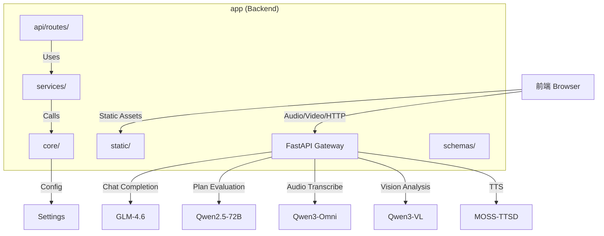

# AI 面试助手 (AI Interview)

## 变更记录 (Changelog)
- **2026-01-25**: 架构文档更新，完成模块结构图与索引分析
- **2026-01-24**: 完成项目初始化，识别 FastAPI 架构及 Qwen/MOSS 模型依赖

---

## 1. 项目愿景
构建一个智能面试系统，模拟严厉的计算机系博导进行自动化面试。项目基于 **FastAPI** 构建后端，利用 **SiliconFlow** 提供的多模态大模型能力，实现"语音输入 -> 意图理解 -> 文本回复 -> 语音合成"的全链路交互。

## 2. 架构总览
- **核心框架**: Python FastAPI
- **AI 能力提供商**: SiliconFlow (硅基流动)
- **模型矩阵**:
  - **语音/多模态理解**: `Qwen/Qwen3-Omni-30B-A3B-Instruct` (支持 Audio URL 输入)
  - **语音合成 (TTS)**: `fnlp/MOSS-TTSD-v0.5` (Voice: anna/david)
  - **视觉分析**: `Qwen/Qwen3-VL-30B-A3B-Instruct`
  - **对话生成**: `zai-org/GLM-4.6` (带模型降级链)
  - **计划评估**: `Qwen/Qwen2.5-72B-Instruct`
- **前端交互**: 静态 HTML/JS (位于 `static/` 目录)

## 3. 模块结构图


## 4. 模块索引
| 模块路径 | 类型 | 职责 |
| :--- | :--- | :--- |
| [`./app`](./app/CLAUDE.md) | FastAPI Backend | 核心业务逻辑、API 代理、静态资源托管 |
| `app/api/routes/` | API Routes | 面试接口、系统接口 |
| `app/services/` | Services | LLM 服务、面试服务、文件解析服务 |
| `app/core/` | Core | 配置管理、日志系统 |
| `app/schemas/` | Schemas | 请求数据模型定义 |
| `app/static/` | Frontend | Web 前端界面 |

## 5. 运行与开发

### 环境准备
```bash
# 安装依赖
cd app
pip install -r requirements.txt

# 配置环境变量 (编辑 .env)
SILICONFLOW_API_KEY=your_api_key_here
```

### 启动服务
```bash
# 方式 1: 直接运行
python -m app.main

# 方式 2: 使用 uvicorn
uvicorn app.main:app --host 0.0.0.0 --port 8000 --reload
```

### 访问地址
- 前端界面: http://localhost:8000/static/index.html
- API 文档: http://localhost:8000/docs

## 6. API 端点说明

| 端点 | 方法 | 功能 |
| :--- | :--- | :--- |
| `/` | GET | 重定向到前端页面 |
| `/api/scenarios` | GET | 获取面试场景列表 |
| `/api/languages` | GET | 获取支持的语言列表 |
| `/api/analyze-resume` | POST | 分析简历并生成面试计划 |
| `/api/analyze-video` | POST | 分析视频帧（防作弊检测） |
| `/api/upload-resume` | POST | 上传简历并生成开场白 |
| `/api/chat` | POST | 语音/文本对话接口 |
| `/api/tts` | POST | 文本转语音 |

## 7. 全局规范
- **凭证安全**：`SILICONFLOW_API_KEY` 必须通过环境变量配置，严禁硬编码。
- **错误处理**：所有上游 API 错误需封装为 standard HTTP Exceptions (500/xxx)。
- **音频格式**：前端录音需兼容后端处理（接收 WAV 格式，转 Base64 Data URI）。
- **日志记录**：使用 `app.core.logger` 统一日志管理，日志文件存放在 `logs/` 目录。

## 8. 测试策略
- 当前项目无正式测试目录
- 建议添加: `app/tests/` 目录用于单元测试和集成测试
- 建议工具: pytest + pytest-asyncio

## 9. 编码规范
- Python 遵循 PEP 8
- 前端使用 ES6+ 模块化开发
- API 接口使用 Pydantic 模型进行验证

## 10. AI 使用指引
当请求 AI 辅助开发时，可参考以下上下文：
- 这是一个基于 FastAPI 的全模态面试系统
- 后端采用模块化结构 (routes/services/core/schemas)
- 前端使用原生 JS + MediaPipe 进行人脸追踪
- 核心依赖 SiliconFlow 的多模态大模型能力
