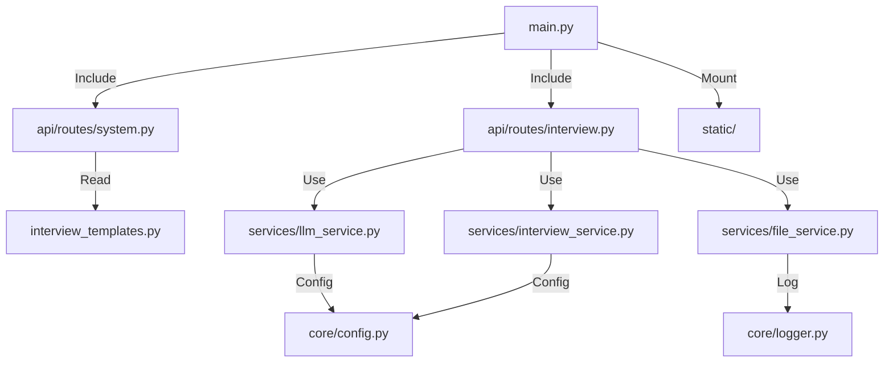

[根目录](../CLAUDE.md) > **app**

---

# App 模块 (Core Backend)

## 变更记录 (Changelog)
- **2026-01-25**: 完成模块架构分析，更新接口定义与依赖说明

---

## 1. 模块职责
基于 FastAPI 的核心后端服务，主要职责是作为前端与 SiliconFlow AI 服务之间的安全网关，处理音频/视频数据的编码转换和 Prompt 注入，实现全模态面试交互。

## 2. 模块结构图


## 3. 入口与启动
| 文件 | 描述 |
| :--- | :--- |
| `main.py` | 应用入口，包含 CORS 配置、静态资源托管、路由注册 |

### 启动命令
```bash
# 从项目根目录
python -m app.main

# 或使用 uvicorn
uvicorn app.main:app --host 0.0.0.0 --port 8000 --reload
```

## 4. 对外接口

### 4.1 系统路由 (`api/routes/system.py`)
| 端点 | 方法 | 功能 |
| :--- | :--- | :--- |
| `/` | GET | 重定向到 `/static/index.html` |
| `/api/scenarios` | GET | 获取所有面试场景模板 |
| `/api/languages` | GET | 获取支持的语言列表 |

### 4.2 面试路由 (`api/routes/interview.py`)
| 端点 | 方法 | 功能 |
| :--- | :--- | :--- |
| `/api/analyze-resume` | POST | 分析简历/上下文，生成结构化面试计划 |
| `/api/analyze-video` | POST | 分析视频帧，检测情绪/视线/作弊行为 |
| `/api/upload-resume` | POST | 上传简历并生成开场白 |
| `/api/chat` | POST | 语音/文本对话核心接口 |
| `/api/tts` | POST | 文本转语音（流式返回音频） |

## 5. 关键依赖与配置

### 5.1 核心依赖 (`requirements.txt`)
```
fastapi          # Web 框架
uvicorn          # ASGI 服务器
httpx            # 异步 HTTP 客户端
python-dotenv    # 环境变量加载
python-multipart # 文件上传处理
jinja2           # 模板引擎
python-docx      # Word 文档解析
PyPDF2           # PDF 文档解析
aiofiles         # 异步文件操作
```

### 5.2 配置文件 (`core/config.py`)
| 配置项 | 说明 | 默认值 |
| :--- | :--- | :--- |
| `API_KEY` | SiliconFlow API 密钥 | 从 `.env` 读取 |
| `BASE_URL` | SiliconFlow API 地址 | `https://api.siliconflow.cn/v1` |
| `MODEL_SENSE` | 语音转写模型 | `Qwen/Qwen3-Omni-30B-A3B-Instruct` |
| `MODEL_VISION` | 视觉分析模型 | `Qwen/Qwen3-VL-30B-A3B-Instruct` |
| `MODEL_CHAIN` | 对话生成模型链 | `zai-org/GLM-4.6` |
| `MODEL_PLAN_EVAL` | 计划评估模型 | `Qwen/Qwen2.5-72B-Instruct` |

## 6. 数据模型 (`schemas/`)
| 模型 | 字段 | 用途 |
| :--- | :--- | :--- |
| `TTSRequest` | `text: str` | TTS 请求 |
| `VideoAnalysisRequest` | `images: List[str]`, `current_topic`, `language` | 视频分析请求 |

## 7. 服务层 (`services/`)

### 7.1 LLM 服务 (`llm_service.py`)
- `generate_thought_response()` - 调用对话模型（支持模型降级链）
- `call_vision_model()` - 调用视觉模型分析图片
- `transcribe_audio()` - 语音转文字

### 7.2 面试服务 (`interview_service.py`)
- `evaluate_plan_async()` - 使用 Function Calling 更新面试计划
- `plan_cache` - 内存缓存（按 session_key 管理）

### 7.3 文件服务 (`file_service.py`)
- `parse_resume()` - 解析 PDF/DOCX/TXT 简历文件

## 8. 前端资源 (`static/`)
| 文件 | 描述 |
| :--- | :--- |
| `index.html` | 单页应用入口（Lumina AI 界面） |
| `app.js` | 前端逻辑核心（录音、视频分析、UI 交互） |
| `style.css` | 样式表（赛博朋克风格） |
| `anim.css` | 动画效果 |

## 9. 已知约束
- **音频兼容性**: Qwen3-Omni 接口通过 `audio_url` 接收 Data URI
- **超时设置**: Chat 接口 60s，TTS 接口 30s，Vision 接口 30s
- **计划缓存**: 当前使用内存缓存，服务重启后丢失

## 10. 相关文件清单
```
app/
├── main.py                      # 应用入口
├── requirements.txt             # Python 依赖
├── .env                         # 环境配置（需自行创建）
├── interview_templates.py       # 面试场景模板（内嵌）
├── api/
│   └── routes/
│       ├── system.py           # 系统路由
│       └── interview.py        # 面试路由
├── services/
│   ├── llm_service.py          # LLM 服务
│   ├── interview_service.py    # 面试计划服务
│   └── file_service.py         # 文件解析服务
├── core/
│   ├── config.py               # 配置管理
│   └── logger.py               # 日志系统
├── schemas/
│   └── requests.py             # 请求模型
└── static/
    ├── index.html              # 前端入口
    ├── app.js                  # 前端逻辑
    ├── style.css               # 样式
    └── anim.css                # 动画
```
